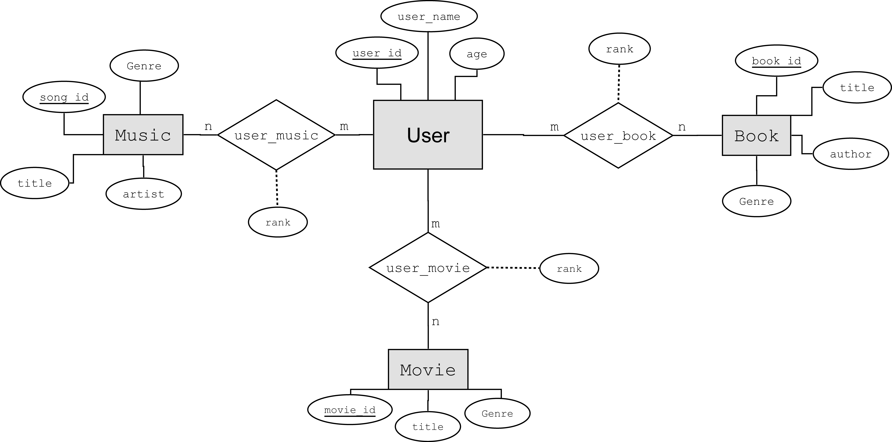
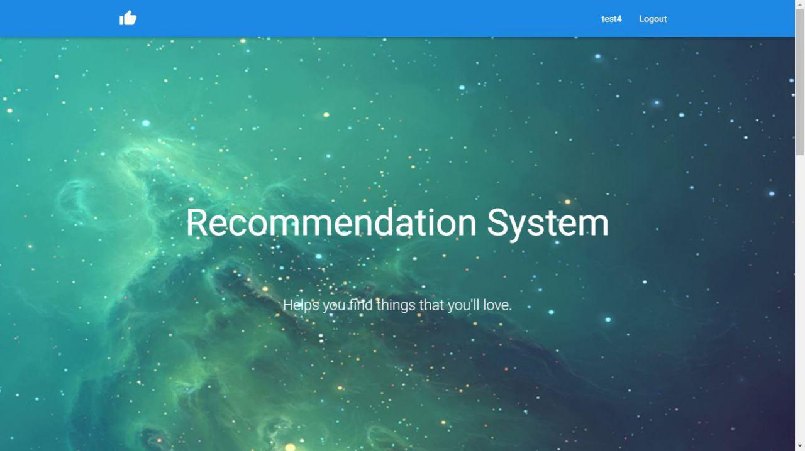
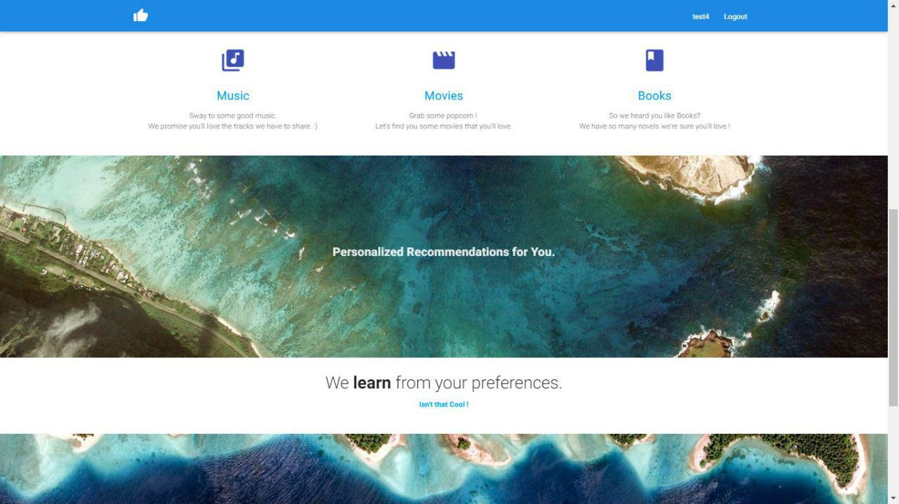
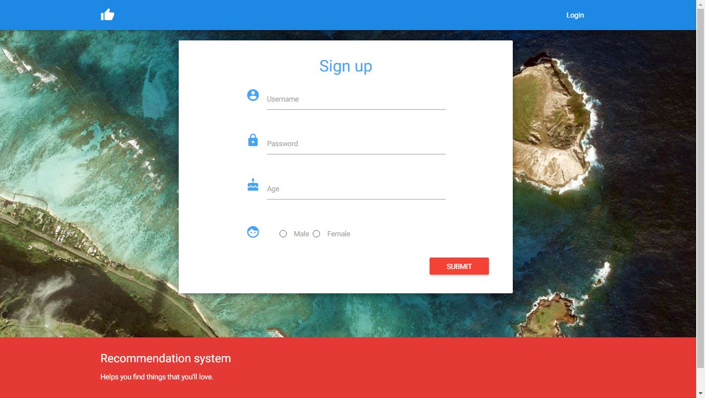
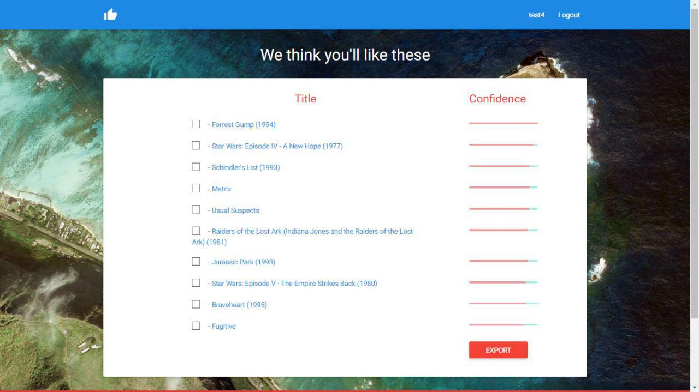

#### (2015) Ancient ML project: 
## Fully SQL Query based Recommendation System 
Recommender system written entirely in SQL queries using a variation on the collaborative filtering. 

## SQL Algorithm:

Written completely in SQL Queries*, the algorithm is an optimized variant of the (once) popular Collaborative Filtering algorithm used originally in ML (Document-retreival/Recommender systems).

This approach retrieves the closest 'neighbors' of the current user based on his/her preferences, and proceeds to do a weighted fetch of the preferences of these neighbors. The idea being that users with similar tastes will have similar rating distributions given the same entity distribution. Simple enough, but very effective written entirely in SQL. 

The Queries are implemented within the Java Servlets.

## Food for thought:
This was implemented back in 2015 on the Oracle 11g Database, with a 0.5 Million row database of user preferences. Given little evidence of scalability, and not much time at hand (college course-work), I was sceptical of an all-SQL implementation of ML/Retreival algorithms being a viable approach moving forward for the industry,

At the moment however, It would be interesting to see how the pure SQL approaches scales with pipelines using smart-sharding, caching/parallel fetching threads on Hive/Cassandra/etc. (Should maybe try it out as a quick side fun project)

## SQL Query Algorithm: 

    -- SQL Query for recommending for example. entities from the movie table to a user, 
    
    -- START --
    with c_user as (select movie_id,rating from user_movie      
                where user_id=?),       --ratings are in the range: [-5,5]. 
            
         ranks as (select um.user_id,x.movie_id,(10 - ABS(x.rating-um.rating)) as rank   
				   from c_user x, user_movie um where um.movie_id in
				   (select movie_id from c_user)),     -- Measures difference in ratings of the current user & other users

         bonds as (select user_id, sum(rank) as bond 
				   from ranks
				   group by user_id),       -- 'Bond' here is thus a measure of user-similarity based on similar movie-ratings

         r_pool as (select movie_id, rating*bond as rating007   
					from user_movie natural join bonds
					where movie_id not in
					(select movie_id from c_user)), -- 'Rating007' weights each movie as the confidence of the recommendation (the user's bond) * it's ratings
			  
	 d_pool as (select movie_id,avg(rating007) as final_score   -- Averages the weights for the movies
	    				from r_pool group by movie_id)
	
	 select title,final_score 
	 from d_pool natural join movie 
         order by final_score desc      -- Orders the Movies from most highly recommended to least recommended movies.
         
    -- END --

## GUI Structure:

Client Side & Front End: HTML, XML, JavaScript & CSS.

Server-Side: Java Servlet servicing User Requests and accessing Oracle Database using a JDBC Connection. 
    
Database (Currently Local): Oracle 11g XE

> Database ER Diagram

> Index page:  

> Index Page (Cont. Scroll): 

> Content Page :

> Create Account Page :

> Recommendations Result Page :

